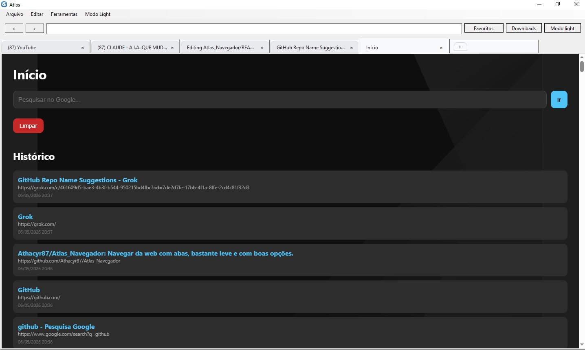

# Atlas Navegador 🌐

**Um navegador multifuncional com abas, editor de código, histórico, favoritos, rascunhos e até um jogo offline** — tudo feito em C# com Windows Forms.

### 📋 Sobre o Projeto

O **Atlas Navegador** é um navegador personalizado desenvolvido em C# que vai muito além de um browser comum. Ele reúne várias ferramentas úteis em uma única aplicação desktop, ideal para desenvolvedores e estudantes que gostam de produtividade e experimentação.

### ✨ Funcionalidades

- **Navegação com Abas** — Sistema completo de múltiplas abas
- **Histórico de Navegação** — Registro e visualização do histórico
- **Favoritos** — Sistema de bookmarks com gerenciamento
- **Editor de Código** — Editor integrado com destaque de sintaxe
- **Abas de Rascunho** — Anotações rápidas e notas temporárias
- **Jogo Offline** — Mini game incluso para relaxar entre uma aba e outra
- **Interface com Abas Modernas** — Experiência fluida e organizada

### 🛠️ Tecnologias Utilizadas

- **C#** + **.NET Framework / .NET 6+**
- **Windows Forms**
- **WebView2** (para renderização das páginas)

### 🎯 Objetivo do Projeto

Praticar e demonstrar conhecimentos em:
- Desenvolvimento de aplicações desktop complexas
- Gerenciamento de múltiplas janelas/abas
- Integração de componentes (WebView2 + controles customizados)
- Persistência de dados
- UX/UI em aplicações Windows

### 📸 Screenshots

